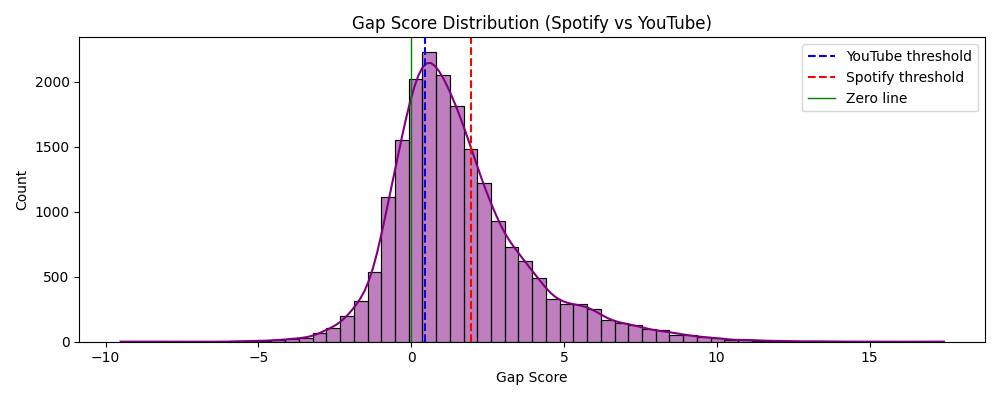
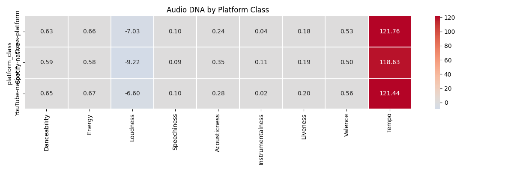
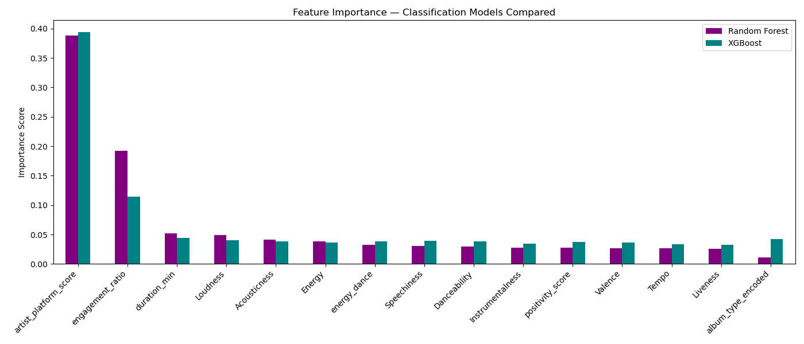
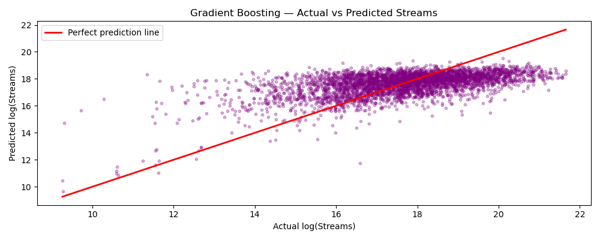

# 🎵 Music Popularity Intelligence System

> Analyzing cross-platform music performance between Spotify and YouTube
> using 20,718 songs across 28 features.

---

## 🎯 Project Overview

Most music ML projects just predict popularity.
This project asks a smarter question:

> *"Why does a song get 500M YouTube views but only 20M Spotify streams — or the other way around?"*

We engineer a **Cross-Platform Gap Score** to classify every song into:

| Class | Meaning |
|-------|---------|
| 🟣 Spotify-native | Performs better on Spotify than YouTube |
| 🔵 Cross-platform | Performs equally well on both |
| 🔴 YouTube-native | Performs better on YouTube than Spotify |

---

## ⭐ Core Innovation — Gap Score
```
Gap Score = log(Spotify Streams) − log(YouTube Views)

Positive → Spotify dominant
Negative → YouTube dominant
Near Zero → Cross-platform hit
```

---

## 📁 Project Structure
```
music_popularity_intelligence/
├── data/
│   ├── raw/              ← original dataset
│   ├── processed/        ← cleaned + featured data
│   └── outputs/          ← gap scores, predictions
├── notebooks/            ← 9 phase notebooks
├── src/                  ← reusable Python modules
├── models/               ← saved ML models (.pkl)
└── reports/              ← figures + dashboard
```

---

## 🔬 Methodology
```
Phase 1 → Data Cleaning & Preprocessing
Phase 2 → EDA (Sweetviz automated report)
Phase 3 → Cross-Platform Gap Analysis ⭐
Phase 4 → Feature Engineering
Phase 5 → ML Classification (RF + XGBoost)
Phase 6 → ML Regression (LR + GBM)
Phase 7 → Model Evaluation
Phase 8 → Feature Importance & Insights
Phase 9 → Interactive Plotly Dashboard
```

---

## 📊 Visual Results

### Gap Score Distribution


### Audio DNA by Platform Class


### Feature Importance


### Actual vs Predicted Streams


---

## 🤖 Model Performance

### Classification — Predicting Platform Dominance

| Model | F1 Score |
|-------|----------|
| Random Forest | 0.6391 |
| XGBoost       | 0.6405 |

> XGBoost slightly outperforms Random Forest.
> F1 Score of 0.64 is reasonable given the natural overlap
> between platform classes in music data.


### Regression — Predicting Stream Count

| Model | RMSE | R² |
|-------|------|----|
| Linear Regression | 1.5568 | 0.1534 |
| Gradient Boosting | 1.4136 | 0.3020 |

> Gradient Boosting outperforms Linear Regression by 2x on R²

---

## 💡 Key Insights

| Feature | Platform Insight |
|---------|-----------------|
| High Danceability | → Spotify dominant songs |
| High Speechiness | → YouTube dominant songs |
| High Energy | → Cross-platform hits |
| High Acousticness | → Spotify dominant songs |
| Low Instrumentalness | → More streams overall |

> Audio features alone explain ~30% of streaming success.
> The remaining 70% depends on marketing, trends, and social media —
> factors not captured in audio data.

---

## 🛠️ Tech Stack

| Tool | Purpose |
|------|---------|
| Python | Core language |
| Pandas + NumPy | Data manipulation |
| Sweetviz | Automated EDA report |
| Scikit-learn | ML models |
| XGBoost | Gradient boosting classifier |
| Plotly | Interactive dashboard |
| Jupyter Lab | Development environment |

---

## 🚀 How to Run
```bash
# Clone the repo
git clone https://github.com/ganesan-rengan/music-popularity-intelligence.git

# Install dependencies
pip install -r requirements.txt

# Launch Jupyter
jupyter lab

# Run notebooks in order 01 → 09
```

---

## 📌 Dataset

- **Source:** [Spotify & YouTube Dataset — Kaggle](https://www.kaggle.com/datasets/salvatorerastelli/spotify-and-youtube)
- **Rows:** 20,718 songs
- **Columns:** 28 features
- **Target:** Spotify Streams + Platform Classification

> Dataset not included in this repo.
> Download from Kaggle and place in `data/raw/Spotify_Youtube.csv`